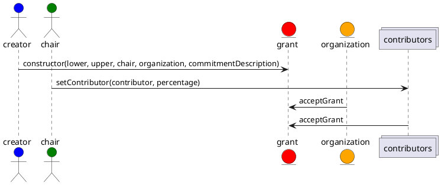
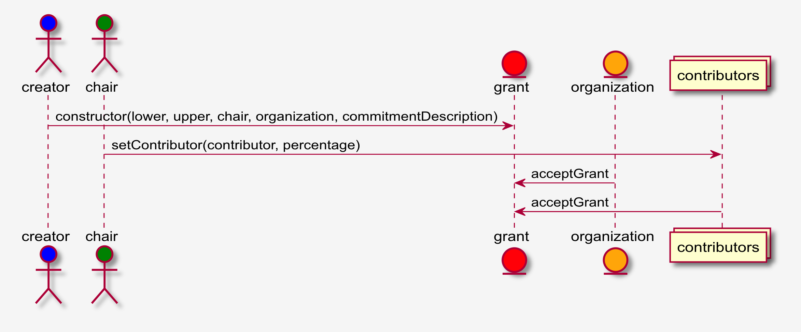
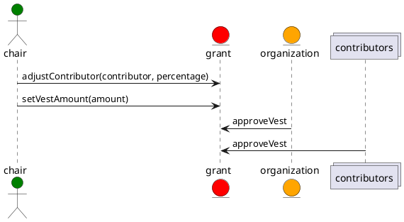
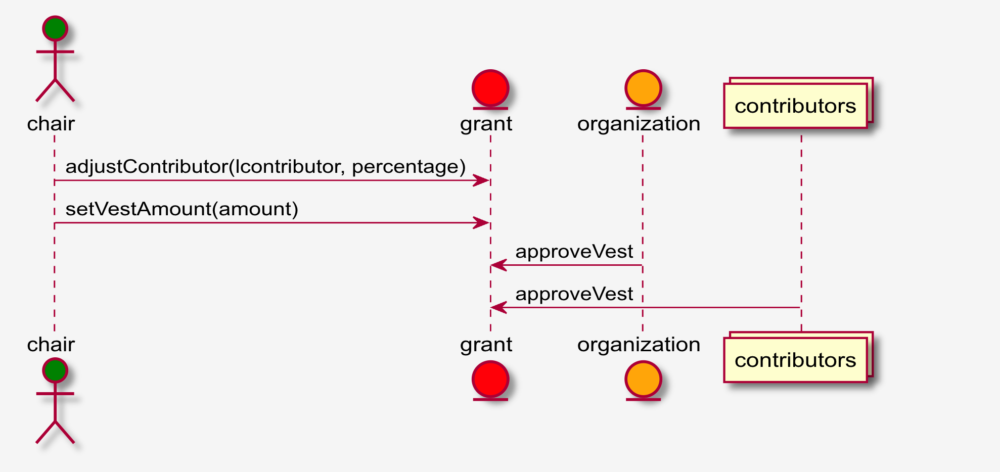
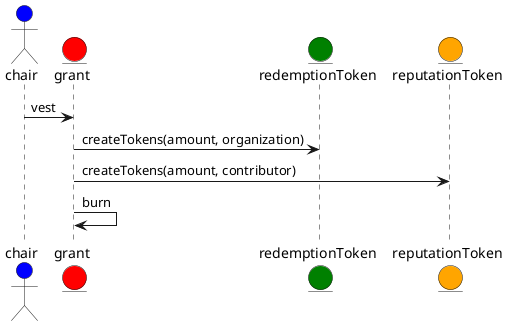
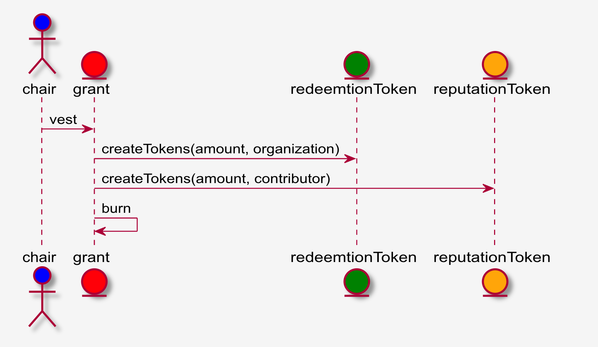

# Sequence diagram for the EEA Token Reward Grant

A grant is created for each organization contributing to an EEA Working Group or Special Interest Group.  The chair or co-chair will create the grant request from a template form indicating the reward amount, organization, commitment description, commitment outcome, the organization's contributors with expected contribution percentages equal to 100%.

The reward amount represents the total positive reward that will be minted into both Reward and Reputation tokens. The Reward tokens will be rewarded to the organization and the reputation tokens will be split according to percentages to the organization's contributors. The reward amount has a lower and an upper bound where the lower bound can be a negative number and the upper bound represents the maximum potential.

Assumptions:

- A role is defined that can create new grants
- A simple email or GitHub template or ticket can be created and handled by the role responsible for creating grants
- The chair role will become the owner of the grant with the ability to modify percentages and total vest amount

## CreateGrant

## AdjustGrant

Prior to vesting, the grant should be adjusted for actual percentage of contribution and the vesting amount.

## VestGrant

